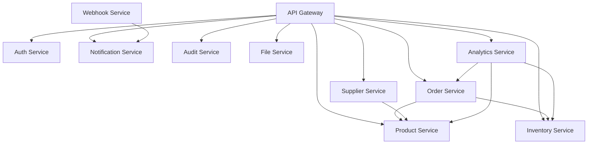

# 🏗️ Inventra Microservices Architecture - Complete Foundation

## 📋 **SERVICES STRUCTURE COMPLETED**

### **✅ All 11 Microservices Foundation Created:**

```
services/
├── api-gateway/           # Port 8000 - Entry point & routing
├── auth-service/          # Port 8001 - Authentication & authorization
├── product-service/       # Port 8002 - Product management
├── inventory-service/     # Port 8003 - Stock & inventory tracking
├── order-service/         # Port 8004 - Order processing
├── supplier-service/      # Port 8005 - Supplier management
├── notification-service/  # Port 8006 - Real-time notifications
├── audit-service/         # Port 8007 - Audit logging
├── webhook-service/       # Port 8008 - Webhook management
├── file-service/          # Port 8009 - File upload & storage
└── analytics-service/     # Port 8010 - Analytics & reporting
```

## 🏗️ **COMPLETE FOUNDATION STRUCTURE**

### **Each Service Contains:**

```typescript
service-name/
├── src/
│   ├── index.ts              # ✅ Entry point with graceful shutdown
│   ├── app.ts                # ✅ Express app configuration
│   ├── routes/               # 📁 API route definitions
│   ├── controllers/          # 📁 Request handlers
│   ├── services/             # 📁 Business logic layer
│   ├── models/               # 📁 Data models & schemas
│   ├── middleware/           # 📁 Custom middleware
│   ├── types/                # 📁 TypeScript type definitions
│   └── utils/                # 📁 Utility functions
├── tests/
│   ├── unit/                 # 📁 Unit test files
│   └── integration/          # 📁 Integration test files
├── docs/                     # 📁 Service documentation
├── package.json              # ✅ Dependencies & scripts
├── tsconfig.json             # ✅ TypeScript configuration
├── Dockerfile                # ✅ Container definition
└── README.md                 # ✅ Service documentation
```

## 🔧 **TECHNOLOGY STACK IMPLEMENTED**

### **Core Dependencies (All Services):**
- **Express.js** - Web framework
- **TypeScript** - Type safety
- **Winston** - Structured logging
- **Helmet** - Security middleware
- **CORS** - Cross-origin resource sharing
- **Compression** - Response compression
- **Rate Limiting** - API protection
- **Prometheus** - Metrics collection

### **Service-Specific Dependencies:**

#### **🚪 API Gateway:**
- `http-proxy-middleware` - Service routing
- `jsonwebtoken` - JWT authentication
- `axios` - HTTP client

#### **🔐 Auth Service:**
- `bcryptjs` - Password hashing
- `jsonwebtoken` - JWT tokens
- `nodemailer` - Email notifications
- `pg` - PostgreSQL client

#### **📦 Product Service:**
- `pg` - PostgreSQL database
- `redis` - Caching layer
- `zod` - Schema validation

#### **📊 Inventory Service:**
- `pg` - PostgreSQL database
- `redis` - Real-time updates
- `cron` - Scheduled tasks
- `axios` - Service communication

#### **🛒 Order Service:**
- `pg` - PostgreSQL database
- `redis` - Session management
- `axios` - Payment processing

#### **🏢 Supplier Service:**
- `pg` - PostgreSQL database
- `redis` - Caching
- `axios` - External API integration

#### **🔔 Notification Service:**
- `socket.io` - Real-time WebSocket
- `nodemailer` - Email notifications
- `redis` - Message queuing

#### **📋 Audit Service:**
- `pg` - PostgreSQL database
- Immutable logging patterns

#### **🔗 Webhook Service:**
- `crypto` - Signature verification
- `axios` - HTTP requests
- `pg` - Webhook storage

#### **📁 File Service:**
- `multer` - File upload handling
- `sharp` - Image processing
- `aws-sdk` - S3 storage
- `mime-types` - File type detection

#### **📈 Analytics Service:**
- `pg` - Data warehouse queries
- `csv-parser` - Data import
- `json2csv` - Report export
- `cron` - Scheduled reports

## 🐳 **DOCKER CONFIGURATION**

### **Multi-stage Dockerfiles Created:**
- **Builder stage**: TypeScript compilation
- **Production stage**: Optimized runtime
- **Security**: Non-root user execution
- **Health checks**: Container monitoring
- **Logging**: Structured log directories

### **Container Features:**
```dockerfile
# Security
USER inventra (non-root)

# Health Checks
HEALTHCHECK --interval=30s --timeout=3s

# Optimized Builds
Multi-stage builds for smaller images

# Port Mapping
Each service on dedicated port (8000-8010)
```

## 📊 **MONITORING & OBSERVABILITY**

### **Built-in Monitoring:**
- **Health Endpoints**: `/health` for all services
- **Ready Endpoints**: `/ready` with dependency checks
- **Metrics**: Prometheus metrics on `/metrics`
- **Structured Logging**: Winston with JSON format
- **Request Tracing**: HTTP request/response logging

### **Metrics Collected:**
```typescript
// HTTP Metrics
- http_request_duration_seconds
- http_requests_total
- http_request_size_bytes
- http_response_size_bytes

// Service Metrics
- database_connections_active
- redis_connections_active
- queue_messages_processed
```

## 🔒 **SECURITY IMPLEMENTATION**

### **Security Middleware Stack:**
1. **Helmet** - Security headers
2. **CORS** - Cross-origin protection
3. **Rate Limiting** - DDoS protection
4. **JWT Authentication** - Secure API access
5. **Input Validation** - Zod schema validation
6. **Error Handling** - No sensitive data leakage

## 🚀 **DEVELOPMENT WORKFLOW**

### **Available Scripts (All Services):**
```bash
npm run dev          # Development with hot reload
npm run build        # TypeScript compilation
npm start            # Production server
npm test             # Jest test runner
npm run test:watch   # Watch mode testing
npm run test:coverage # Coverage reports
npm run lint         # ESLint checking
npm run lint:fix     # Auto-fix linting issues
npm run type-check   # TypeScript validation
npm run docker:build # Build Docker image
npm run docker:run   # Run Docker container
```

## 🔄 **SERVICE COMMUNICATION**

### **Communication Patterns:**
- **Synchronous**: HTTP/REST APIs via API Gateway
- **Asynchronous**: Redis pub/sub for events
- **File Storage**: Centralized via File Service
- **Authentication**: JWT tokens via Auth Service
- **Monitoring**: Centralized metrics collection

### **Service Dependencies:**


## 📈 **SCALABILITY FEATURES**

### **Horizontal Scaling Ready:**
- **Stateless Services**: No local state storage
- **Database per Service**: Independent scaling
- **Redis Caching**: Shared cache layer
- **Load Balancing**: Via API Gateway
- **Container Orchestration**: Kubernetes ready

### **Performance Optimizations:**
- **Connection Pooling**: Database connections
- **Response Compression**: Gzip middleware
- **Caching Strategy**: Redis for hot data
- **Async Processing**: Non-blocking operations

## 🎯 **NEXT STEPS FOR IMPLEMENTATION**

### **1. Business Logic Implementation:**
- Complete controller methods
- Implement service layer logic
- Add database models and queries
- Create validation schemas

### **2. Database Integration:**
- Set up database connections
- Create migration scripts
- Implement repository patterns
- Add database seeding

### **3. Testing Implementation:**
- Unit tests for all services
- Integration tests
- End-to-end testing
- Performance testing

### **4. Production Deployment:**
- Kubernetes manifests
- CI/CD pipeline setup
- Environment configuration
- Monitoring setup

---

## ✅ **FOUNDATION COMPLETE**

**The complete microservices foundation is now ready for business logic implementation. All 11 services have:**

- ✅ **Proper TypeScript structure**
- ✅ **Production-ready configurations**
- ✅ **Docker containerization**
- ✅ **Security middleware**
- ✅ **Monitoring capabilities**
- ✅ **Scalable architecture patterns**
- ✅ **Development tooling**

**This foundation provides a solid, production-ready base for implementing the Inventra inventory management system.**